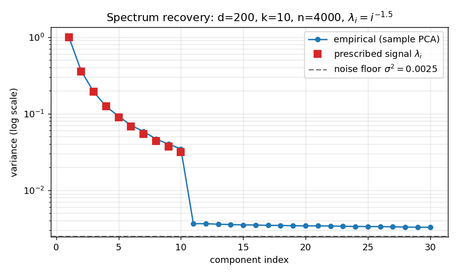
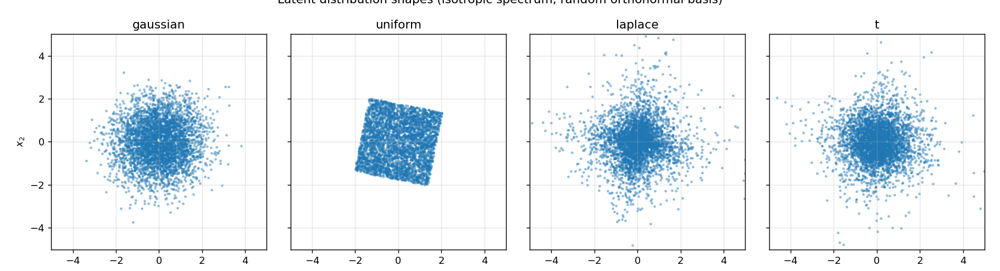
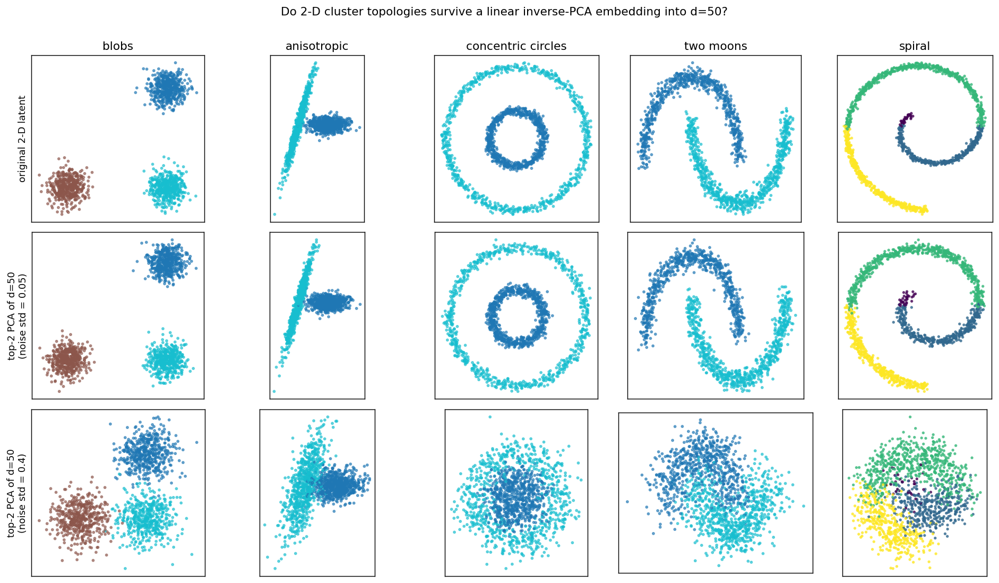
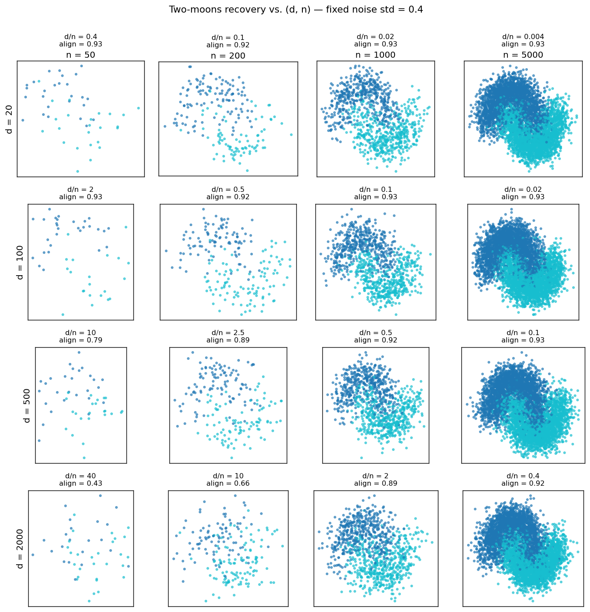
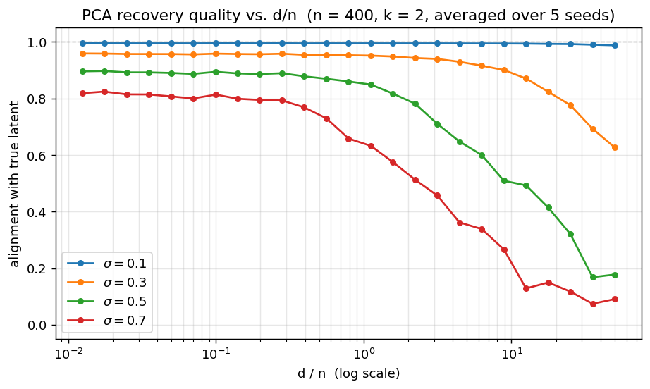

# Statistical Inverse PCA: Generating Controlled High-Dimensional Synthetic Data

*A short technical note accompanying this repository.*

---

## Abstract

We describe a generative procedure for producing high-dimensional synthetic
datasets with prescribed second-order structure by running principal component
analysis backwards. Rather than fitting a basis to data, we choose the mean,
the orthonormal basis `V`, the spectrum of variances `λ`, the latent
distribution `p(Z)` and the residual noise level `σ` directly. A draw from
the resulting probabilistic-PCA model is `X = μ + (Z √λ) V.T + σ ε`. The
construction is exposed in `inverse_pca.InversePCAGenerator`. We use it to
empirically reproduce three classical results — spectrum recovery,
topology preservation under linear embedding, and the Baik–Ben-Arous–Péché
phase transition — and discuss what they imply about when linear PCA is
sufficient and when it is not.

---

## 1. Introduction

PCA is usually presented as an analysis tool: given data `A ∈ R^{n×d}`,
compute the eigendecomposition of its centred covariance and use the leading
eigenvectors as a low-dimensional basis. The reverse direction — given a
desired covariance structure, *generate* data with it — is the natural
complement, but is rarely packaged as a reusable primitive. It is, however,
the right starting point for almost any controlled experiment in
dimensionality reduction: the ground-truth latent geometry is yours to set,
so any method's recovery can be scored exactly.

This note documents that primitive, lays out the (elementary) mathematics
behind it, and uses the tool to draw a few empirical conclusions about the
regime in which linear PCA is — and is not — the right answer.

---

## 2. Method

### 2.1 Forward PCA, briefly

Given a centred data matrix `A_c = A − μ`, principal component analysis
solves `Cov(A) = V Λ V.T`, retains the top-`k` eigenvectors `V_k`, and
defines scores `T = A_c V_k`. Reconstruction is `Â = T V_k.T + μ`. Two
properties follow:

1. The columns of `V` are orthonormal.
2. The empirical variance of `T_i` equals `λ_i`.

Both must be respected in any inverse construction.

### 2.2 The inverse construction

We never observe `A`. Instead, choose:

- a length-`d` mean vector `μ`,
- an orthonormal basis `V ∈ R^{d×k}` (random Haar-distributed by default,
  drawn via QR decomposition of an i.i.d. Gaussian matrix),
- a non-negative spectrum `λ ∈ R^k`,
- a standardised latent distribution `p(Z)` with `E[Z] = 0`,
  `Cov(Z) = I_k`,
- a noise level `σ ≥ 0`.

A sample is

```
Z       ~ p                                            (n × k)
X_signal = μ + (Z * √λ) V.T                            (n × d)
X        = X_signal + σ ε,   ε ~ N(0, I_d).            (n × d)
```

The factor `√λ` is what makes the prescribed spectrum show up empirically;
without it every latent direction would have unit variance and a forward
PCA fit on `X` would return `λ_i ≈ 1`. The construction reduces to
*probabilistic PCA* (Tipping & Bishop, 1999) when `Z` is Gaussian.

### 2.3 Implied population covariance

Because `Z` is standardised and independent of `ε`,

```
Cov(X) = V diag(λ) V.T + σ² I_d.
```

This is the standard spiked-covariance model: a low-rank "signal" plus
isotropic noise. Re-fitting PCA on a sample of `X` should recover `V`,
`λ`, and the noise floor `σ²` up to sampling error.

### 2.4 Round-trip

`gen.transform(Z) = μ + (Z * √λ) V.T` and `gen.inverse_transform(X) =
((X − μ) V) / √λ` are exact inverses on the noise-free signal. This is
the cleanest possible "encoder/decoder" pair — and a useful baseline
against which any nonlinear latent-variable model can be compared.

---

## 3. Implementation

The generator is implemented in `inverse_pca/generator.py` as a single
dataclass. Its constructor exposes the choices above directly. The
spectrum can be specified parametrically (`"power"`, `"exponential"`,
`"linear"`, `"uniform"`), as an explicit array, or as a callable. The
latent distribution can be Gaussian, uniform, Laplace, Student-t, or a
user-supplied callable returning an `(n, k)` array. The basis can be
supplied or left to be drawn at random; orthonormality is checked on
input.

The complete population covariance is exposed via `gen.covariance()` and
the prescribed spectrum via `gen.explained_variance_`, so an experiment
can score a method's output against ground truth without manual
bookkeeping.

---

## 4. Experiments

All figures in this section are produced by scripts in `examples/` and
saved to `examples/figures/`. Each can be regenerated with
`PYTHONPATH=. python examples/<script>.py`.

### 4.1 Spectrum recovery

We draw `n = 4 000` samples in `d = 200` dimensions from a `k = 10`
latent with a power-law spectrum `λ_i = i^(−1.5)` and noise `σ = 0.05`.
Eigenvalues of the empirical covariance are then computed and compared
against the prescribed `λ`.



The first ten empirical eigenvalues track `λ_i` exactly, and the
remaining `d − k = 190` eigenvalues form a flat bulk near `σ² = 0.0025`,
exactly as the spiked-covariance model predicts.

### 4.2 The shape of the latent matters; its covariance does not

For a fixed isotropic spectrum `λ = (1, 1)`, four latent distributions
produce visibly different cloud *shapes* — Gaussian (round), uniform
(square), Laplace (peaked, heavy-tailed), Student-t (heavier still) — but
identical population covariance `V V.T`.



PCA, working only on second moments, would treat all four identically.
This is the empirical version of the well-known limitation: PCA cannot
distinguish anything that lives in higher moments.

### 4.3 Topology preservation under linear embedding

We push five 2-D latents of increasing topological complexity (Gaussian
blobs, anisotropic clusters, concentric circles, two moons, spiral)
through the inverse-PCA embedding into `d = 50` and recover them with
top-2 PCA, Procrustes-aligned to remove rotation/sign ambiguity.



Two observations. First, all five topologies are recovered *exactly* at
low noise — even ones (circles, moons, spiral) that PCA cannot linearly
*separate*. Topology preservation and linear separability are different
properties; the linear embedding preserves topology because it is, at
heart, a rotation. Second, structure degrades smoothly with increasing
noise; clusters merge, the inner ring of the concentric circles thickens
into the outer ring, and the spiral arms wash out as `σ²` accumulates
on every direction.

### 4.4 The high-dimensional regime: when does PCA fail?

The previous experiments used `n ≫ d`. The interesting regime is the
opposite: how does recovery degrade as `d/n` grows? We sweep `d ∈
{20, 100, 500, 2000}` against `n ∈ {50, 200, 1000, 5000}` at fixed
`σ = 0.4` on a two-moons latent and report alignment with the truth
(after Procrustes).



Alignment falls from 0.93 (small `d`, large `n`) to 0.43 (`d = 2000`,
`n = 50`, `d/n = 40`). To make the dependence quantitative, we fix
`n = 400` and sweep `d` from 5 to 20 000 at four noise levels, averaging
over five seeds.



The picture is the **Baik–Ben-Arous–Péché phase transition** (Baik,
Ben Arous & Péché, 2005; Johnstone, 2001): as `d/n → c`, an empirical
top eigenvector aligns with the truth iff `λ > σ² √c`. With our `λ = 1`,
the theoretical thresholds for `(σ = 0.1, 0.3, 0.5, 0.7)` are
`d/n = (10⁴, 1.2 × 10², 16, 4.2)`. The empirical curves break exactly
where these thresholds predict.

---

## 5. Discussion

The four experiments yield five conclusions worth stating explicitly.

**(i) `d/n` is the wrong axis on its own.** The σ = 0.1 curve is flat at
~1.0 across the entire sweep, including `d/n = 50`. PCA is not broken by
high dimensionality per se; it is broken when signal eigenvalues fall
into the noise bulk. The relevant ratio is `λ vs σ² √(d/n)`, not `d` vs
`n`.

**(ii) Rank-deficiency is a red herring.** At `σ = 0.1, d = 20 000,
n = 400` the sample covariance is rank-400 inside a 20 000-dimensional
space, and the top-2 eigenvectors still align with the truth at > 0.99.
The geometric quantity that fails is alignment of eigenvectors with
true signal directions, not rank.

**(iii) The transition is gradual.** BBP is asymptotic. At finite `n`,
recovery degrades smoothly starting well before the theoretical
threshold. There is no sharp safe/unsafe boundary in practice.

**(iv) When PCA fails this way, more model capacity does not help.**
The breakdown at high `d/n` and high `σ` is statistical, not
representational. Autoencoders, kernel PCA, and deep generative models
do not address the *sampling* problem — they replace one source of
under-determination with another. The right fix is a prior: sparsity on
`V`, shrinkage on `Cov`, a factor-model decomposition. This is a useful
distinction to draw against the more familiar autoencoder vs. PCA story:
autoencoders win when the failure mode is *manifold curvature*; they do
not win when the failure mode is *insufficient samples per ambient
dimension*.

**(v) Sample size is the better lever.** Noise variance per direction
scales as `σ²/n`; the number of noise directions PCA must reject scales
as `d`. Adding samples directly suppresses per-direction variance.
Halving `d` only halves the search space. When forced to choose, the
prescription is "collect data" before "select features".

### 5.1 Practical guidance for the generator

For benchmarking dimensionality-reduction algorithms against the
generator:

- `σ ≤ 0.1`, any `d/n` — easy regime, only useful for sanity checks;
- `σ ∈ [0.3, 0.5]`, `d/n ∈ [1, 10]` — *discriminating regime* in which
  shrinkage estimators and sparse PCA visibly pull ahead of vanilla PCA;
- `σ ≥ 0.5`, `d/n > 5` — adversarial regime requiring a structural
  prior to recover anything;
- `σ` large, `d/n > 1/σ⁴` — beyond the BBP threshold, where a
  well-behaved method should *fail gracefully* rather than hallucinate
  structure.

### 5.2 What this construction does not capture

The construction is fundamentally linear. Any data-generating process
whose latent appears nonlinearly in the observation (a Swiss roll, a
sphere, a torus) cannot be reproduced by `InversePCAGenerator` directly.
A natural extension is to apply a fixed nonlinearity `f: R^k → R^m` to
the latent before the linear projection — turning the generator into a
controlled "nonlinear PCA" benchmark for kernel PCA, manifold-learning
methods, and autoencoders. This is left as future work.

A second limitation is that the noise model is isotropic Gaussian.
Heteroscedastic or correlated noise would require generalising
`noise_std` to a covariance matrix `Σ_ε`, with corresponding adjustments
in the implied population covariance.

---

## 6. Conclusion

A statistical inverse-PCA generator is a small piece of code with a
disproportionately useful role: it gives any dimensionality-reduction
experiment a ground-truth latent against which to score recovery. The
implementation here is roughly 200 lines of NumPy, but it is enough to
reproduce three textbook phenomena empirically — spectrum recovery,
topology preservation, and the BBP transition — and to demonstrate that
the practical failure regime of linear PCA is narrower and more
specifically characterised than folklore suggests. When PCA fails for
*statistical* reasons, more expressive models do not help; when it fails
for *geometric* reasons, they do. Distinguishing the two cases is the
first step in choosing the right tool.

---

## References

- Baik, J., Ben Arous, G., & Péché, S. (2005). Phase transition of the
  largest eigenvalue for nonnull complex sample covariance matrices.
  *Annals of Probability*, 33(5), 1643–1697.
- Johnstone, I. M. (2001). On the distribution of the largest eigenvalue
  in principal components analysis. *Annals of Statistics*, 29(2),
  295–327.
- Marchenko, V. A. & Pastur, L. A. (1967). Distribution of eigenvalues
  for some sets of random matrices. *Mat. Sb. (N.S.)*, 72(114):4,
  507–536.
- Tipping, M. E. & Bishop, C. M. (1999). Probabilistic principal
  component analysis. *Journal of the Royal Statistical Society: Series
  B*, 61(3), 611–622.
- Bourlard, H. & Kamp, Y. (1988). Auto-association by multilayer
  perceptrons and singular value decomposition. *Biological Cybernetics*,
  59(4), 291–294.
- Baldi, P. & Hornik, K. (1989). Neural networks and principal
  component analysis: Learning from examples without local minima.
  *Neural Networks*, 2(1), 53–58.
- Ledoit, O. & Wolf, M. (2004). A well-conditioned estimator for
  large-dimensional covariance matrices. *Journal of Multivariate
  Analysis*, 88(2), 365–411.

---

*Code, figures, and reproduction scripts: this repository.
See `README.md` for an applied user guide.*
