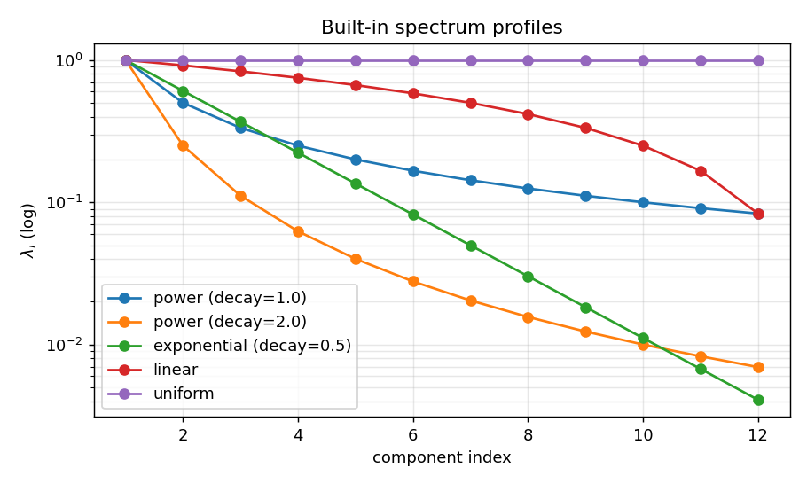
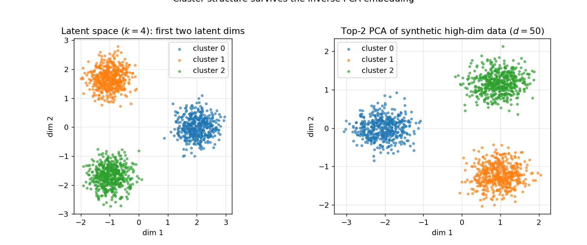
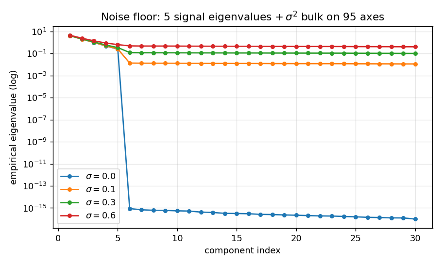

# Inverse PCA: Synthetic High-Dimensional Data from a Latent Space

`inverse_pca` runs PCA *backwards*. Instead of fitting principal components
to a real dataset, you **prescribe** the statistical structure — a mean
vector, an orthonormal basis, a spectrum of variances, a latent distribution,
and (optionally) a noise level — and draw high-dimensional samples that obey
that structure exactly.

This makes it easy to produce controlled benchmarks: low intrinsic
dimensionality embedded in a high ambient dimension, heavy-tailed factors,
isotropic vs. anisotropic noise, etc.

---

## Installation

```bash
pip install -e .            # editable install
pip install -e .[test]      # plus pytest
```

Only dependency is `numpy>=1.22`.

---

## Quick start

```python
from inverse_pca import InversePCAGenerator

gen = InversePCAGenerator(
    n_features=200,        # ambient dimensionality d
    n_components=5,        # latent dimensionality k
    spectrum="power",      # how component variances decay
    spectrum_decay=1.5,    # alpha in lambda_i = i^(-alpha)
    noise_std=0.05,        # isotropic residual noise
    latent_dist="gaussian",
    random_state=0,
)

X, Z = gen.sample(2_000, return_latent=True)
# X: (2000, 200) high-dimensional samples
# Z: (2000, 5) standardised latent scores used to make X
```

`gen.components_`, `gen.explained_variance_`, `gen.explained_variance_ratio_`,
`gen.mean_`, and `gen.covariance()` expose the population quantities the
generator was built from. They are the *ground truth* — re-fitting PCA on `X`
should recover them up to sampling error.

The convenience wrapper

```python
from inverse_pca import make_synthetic_dataset
X, Z, gen = make_synthetic_dataset(n_samples=2_000, n_features=200,
                                   n_components=5, random_state=0)
```

does the same in one call.

---

## The maths

### Forward PCA on a real dataset A

1. Centre: `mu = A.mean(axis=0)`, `A_c = A - mu`.
2. Sample covariance: `Cov(A) = (1/(n-1)) A_c.T @ A_c`.
3. Eigendecomposition: `Cov(A) = V Λ V.T`, with `V` orthonormal eigenvectors
   (columns) and `Λ = diag(λ_1, …, λ_d)` with `λ_1 ≥ λ_2 ≥ …`.
4. Truncate to the top `k`: keep `V_k ∈ R^{d×k}` and `λ_{1..k}`.
5. Scores (low-dimensional representation): `T = A_c V_k`.
6. Reconstruction: `A_hat = T V_k.T + mu`.

In step 5, the scores have empirical variance equal to the eigenvalues:
`Var(T_i) ≈ λ_i`. This is the property we have to put back by hand when going
the other way.

### The inverse construction

We never have `A`. Instead we *choose* the population covariance directly.
Pick:

- a length-`d` mean vector `mu`,
- an orthonormal `d × k` basis `V`,
- a non-negative spectrum `λ ∈ R^k`,
- a standardised latent distribution `p(Z)` with `E[Z]=0`, `Cov(Z)=I_k`,
- a noise level `σ ≥ 0`.

A draw is then

```
Z       ~ p           (n × k, unit-variance latent scores)
X_signal = mu + (Z * sqrt(lambda)) @ V.T          (n × d)
X        = X_signal + sigma * eps,    eps ~ N(0, I_d)
```

The `sqrt(λ)` factor is what makes the prescribed spectrum show up
empirically — without it every latent direction would have unit variance and
re-fitting PCA on `X` would return `λ_i ≈ 1`.

This is exactly the reconstruction line `np.dot(data_reduced, components) + mean`
that you would use after fitting PCA, with `data_reduced = Z * sqrt(λ)` and
`components = V.T`.

### Implied population covariance

Because `Z` is standardised and independent of `eps`,

```
Cov(X) = V diag(lambda) V.T + sigma^2 I_d.
```

So the rank-`k` "signal" covariance is exactly the spectral form, and a real
PCA fitted on a large sample of `X` will recover `V`, `λ`, plus a noise floor
of roughly `σ²` on the discarded `d − k` axes (the classic *probabilistic
PCA* / *factor analysis* picture, Tipping & Bishop 1999).

`gen.covariance()` returns this matrix directly so you can compare it against
`np.cov(X.T)` from a sample.

### Round-trip

`gen.transform(Z)` evaluates `mu + (Z * sqrt(λ)) V.T` (no noise).
`gen.inverse_transform(X)` returns `((X − mu) V) / sqrt(λ)`. Because `V` is
orthonormal, these are exact inverses on the noise-free signal:

```python
np.allclose(gen.inverse_transform(gen.transform(Z)), Z)  # True
```

---

## Tweaking the statistical properties

Each constructor argument changes one feature of the generated population.
Below is the full matrix of knobs, with the effect each one has on a sample
drawn from the generator.

### 1. Intrinsic vs. ambient dimensionality — `n_features`, `n_components`

`n_features = d` is what you actually observe. `n_components = k` is the
intrinsic rank of the signal. With `k ≪ d` and `noise_std = 0`, all samples
lie on a `k`-dimensional affine subspace of `R^d`. Increasing `noise_std`
fattens that subspace into a thin "pancake".

```python
# 5-d signal in 1000-d ambient space, noise floor at 0.01
gen = InversePCAGenerator(n_features=1000, n_components=5, noise_std=0.01)
```

### 2. Eigenvalue profile — `spectrum`, `spectrum_decay`

Controls how much variance each latent axis carries.

| Choice            | Formula                          | Use when…                                  |
| ----------------- | -------------------------------- | ------------------------------------------ |
| `"power"` (def.)  | `λ_i = i^(-α)`                   | Natural-image-like, slow polynomial decay  |
| `"exponential"`   | `λ_i = exp(-α (i-1))`            | Rapidly diminishing returns past first PCs |
| `"linear"`        | `λ_i = max(1 − (i−1)/k, ε)`      | Roughly equal but ranked components        |
| `"uniform"`       | `λ_i = 1`                        | Isotropic latent (no preferred direction)  |
| explicit `array`  | whatever you pass                | Reproduce a specific real spectrum         |
| callable `f(k)`   | user-defined                     | Custom rules (e.g. plateau then drop)      |

`spectrum_decay = α` is the only knob for the parametric profiles. Larger
`α` ⇒ steeper concentration in the leading components.

```python
# Reproduce a measured spectrum from a real dataset
real_eigs = np.array([12.4, 3.1, 1.7, 0.9, 0.4])
gen = InversePCAGenerator(n_features=50, n_components=5, spectrum=real_eigs)
```

### 3. Mean vector — `mean`

Shifts the cloud bodily. Doesn't change covariance, only `E[X]`.

```python
gen = InversePCAGenerator(n_features=20, n_components=3,
                          mean=np.linspace(-1, 1, 20))
```

### 4. Basis orientation — `basis`

If omitted, a uniformly random orthonormal `V` is drawn. Pass your own when
you want axis-aligned signal, sparse loadings, or to copy the basis from a
real fit.

```python
# Axis-aligned: first k canonical directions carry all signal
V = np.eye(d)[:, :k]
gen = InversePCAGenerator(n_features=d, n_components=k, basis=V)
```

A `ValueError` is raised if the supplied basis is not orthonormal — that is
required for `Cov(X)` to factor cleanly.

### 5. Latent distribution — `latent_dist`, `df`

Changes the *shape* of the signal cloud, but not its covariance (each option
is rescaled to unit variance so that the prescribed spectrum still holds).

| Choice         | Effect                                                          |
| -------------- | --------------------------------------------------------------- |
| `"gaussian"`   | Elliptical contours, no skew / kurtosis                         |
| `"uniform"`    | Bounded support, sharp edges (good for ICA-style benchmarks)    |
| `"laplace"`    | Heavier tails than Gaussian, peaked at zero                     |
| `"t"` + `df`   | Very heavy tails (small `df`); `df > 2` enforced for finite var |
| callable       | Anything: mixtures of Gaussians ⇒ clusters, copulas ⇒ deps      |

A custom callable receives `(n_samples, n_components, rng)` and must return
an `(n, k)` array. Example clustered latent:

```python
def two_clusters(n, k, rng):
    centres = np.array([[ 1.5]*k, [-1.5]*k])
    labels  = rng.integers(0, 2, size=n)
    return centres[labels] + rng.standard_normal((n, k)) * 0.5

gen = InversePCAGenerator(n_features=100, n_components=4,
                          latent_dist=two_clusters, spectrum="uniform")
```

### 6. Residual noise — `noise_std`

Adds isotropic Gaussian noise `eps ~ N(0, σ² I_d)` after projection. Makes
the model identical to *probabilistic PCA*. Push `σ` up and the leading
empirical eigenvalues stay near `λ_i + σ²` while the trailing `d − k` ones
form a noise floor at `σ²`.

```python
gen = InversePCAGenerator(n_features=200, n_components=5,
                          spectrum="exponential", spectrum_decay=0.7,
                          noise_std=0.2)
```

### 7. Reproducibility — `random_state`

An int seed or a `np.random.Generator`. Controls *both* the random
orthonormal basis (when `basis is None`) and every subsequent
`sample()` call.

---

## Recipes

```python
# (a) Small-N, large-p classification benchmark with a clean low-rank signal
def labelled_latent(n, k, rng):
    y = rng.integers(0, 3, size=n)                 # 3 classes
    centres = rng.standard_normal((3, k)) * 2.0
    return centres[y] + rng.standard_normal((n, k))

X, Z, gen = make_synthetic_dataset(
    n_samples=300, n_features=5_000, n_components=8,
    spectrum="power", spectrum_decay=1.0,
    latent_dist=labelled_latent, noise_std=0.1, random_state=0,
)

# (b) "Spiked" covariance for testing eigenvalue thresholding
gen = InversePCAGenerator(
    n_features=500, n_components=3,
    spectrum=np.array([20.0, 10.0, 5.0]),  # three clearly spiked eigenvalues
    noise_std=1.0,                          # bulk Marchenko–Pastur-style noise
)

# (c) Heavy-tailed factor model (returns-like data)
gen = InversePCAGenerator(
    n_features=50, n_components=4,
    spectrum="exponential", spectrum_decay=0.5,
    latent_dist="t", df=4.0,
    noise_std=0.02,
)
```

---

## Verifying the construction

Run the bundled demo and unit tests:

```bash
PYTHONPATH=. python examples/demo.py
PYTHONPATH=. python -m pytest tests/
```

The demo draws `(2000, 200)` samples from a 5-d latent with `λ_i = i^(-1.5)`,
re-fits PCA on the result, and prints prescribed vs. recovered eigenvalues —
they agree to within sampling error, confirming the inverse construction is
statistically consistent with what a forward PCA would have produced.

---

## Worked examples with figures

All five plots below are produced by

```bash
PYTHONPATH=. python examples/plot_examples.py
```

which writes them to `examples/figures/`.

### Example 1 — Re-fit PCA recovers the prescribed spectrum

`d=200`, `k=10`, `n=4 000`, `λ_i = i^(-1.5)`, `σ=0.05`. Empirical eigenvalues
of `Cov(X)` track the prescribed `λ_i` for the first ten components, then
collapse to the `σ²` noise floor — the population covariance
`V diag(λ) V.T + σ² I` is recovered up to sampling noise.


### Example 2 — Built-in spectrum profiles

The shape of `λ_i` controls how concentrated the signal is in the leading
components. Power (low α) gives slow polynomial decay, exponential gives
a knee, linear is gentle, uniform is isotropic — pick whichever matches the
benchmark you want.



### Example 3 — Latent distribution changes the *shape*, not the covariance

All four panels use an isotropic spectrum (`λ = [1, 1]`), so each cloud has
the same covariance. The Gaussian latent gives round contours, the uniform
latent gives a sharp-edged square (rotated by the random `V`), Laplace is
peaked with longer tails, Student-t (`df=5`) is heavy-tailed.


### Example 4 — Cluster structure in the latent space survives

A three-cluster Gaussian-mixture latent (`k=4`) is pushed through to
`d=50` and corrupted with `σ=0.1` noise. Re-fitting PCA on the high-dim
sample and projecting onto its top two components recovers the original
cluster geometry up to a rotation/reflection of the latent axes — exactly
what you'd want when generating synthetic classification benchmarks.



### Example 5 — Sweeping the noise level

Same five-spike spectrum `λ = [4, 2, 1, 0.5, 0.25]`, varying `σ`. The signal
eigenvalues stay in place; the trailing `d − k` axes collect a flat bulk
near `σ²`. With `σ = 0` the bulk is at machine precision (numerical zero),
giving the clean rank-`k` plateau on the blue line.



### Example 6 — Do 2-D cluster topologies survive the embedding?

Five 2-D patterns of increasing topological difficulty (Gaussian blobs,
anisotropic clusters, concentric circles, two moons, spiral) are pushed
into `d=50` with `InversePCAGenerator.transform`, then recovered with the
top-2 components of a re-fit PCA on the high-dim sample. Recoveries are
Procrustes-aligned to the originals so PCA's sign/rotation ambiguity does
not muddy the comparison.


Two takeaways:

1. **Linear inverse PCA preserves any 2-D topology exactly** — the
   embedding is a rotation into `d`-dim followed by an inverse rotation,
   so concentric circles, moons, and spirals all come back intact even
   though PCA cannot *linearly separate* them as a classifier. Topology
   preservation and linear separability are different questions.
2. **Noise is what breaks structure**, not the embedding. With `σ = 0.05`
   the recoveries are visually identical to the originals. With `σ = 0.40`
   the moons start to merge, the inner ring of the concentric circles
   thickens into the outer ring, and the spiral arms wash out — the noise
   floor `σ² I_d` accumulates onto every direction including the two that
   carry the signal.

This is generated by `examples/plot_cluster_preservation.py`.

### Example 7 — Sweeping d and n: when does recovery break down?

The previous examples used `n ≫ d`. The interesting regime is when ambient
dimensionality `d` is comparable to or larger than the sample size `n` —
the "high-dimensional statistics" setting where sample covariance becomes
a noisy estimator of the population covariance.

We push the standardised two-moons latent through `InversePCAGenerator`
at every combination of `d ∈ {20, 100, 500, 2000}` and
`n ∈ {50, 200, 1000, 5000}` with fixed noise `σ = 0.4`, recover via
top-2 PCA + Procrustes alignment, and report an alignment score (1.0 =
perfect, 0 = random).


Reading the grid:

- **Top-left corner (small d, large n)**: classical regime, recovery is
  clean even at this relatively heavy noise level.
- **Bottom-left corner (large d, small n, e.g. d=2000, n=50, d/n=40)**:
  alignment collapses to ~0.43 — the sample covariance has only 50
  samples to estimate a 2000-dimensional structure, the leading
  eigenvectors drift toward the noise, and the moons disappear.
- **Right column (n=5000)**: rescues every d in the grid because large
  `n` averages down the per-direction noise variance like `1/n`.

### Example 8 — The BBP-style phase transition

To make the qualitative grid quantitative, we fix `n = 400` and sweep
`d` from 5 to 20 000 (so `d/n` runs from 0.012 to 50) at four noise
levels, averaging alignment over 5 random seeds.


This reproduces the **spiked-covariance / BBP phase transition** from
random-matrix theory (Baik–Ben Arous–Péché 2005, Johnstone 2001). The
relevant theorem says: in the limit `n, d → ∞` with `d/n → c`, an
empirical principal eigenvector aligns with the true direction iff the
signal eigenvalue exceeds `σ² √c`. Below that threshold the recovered
direction is essentially random.

What you see on the plot:

- **σ = 0.1** (blue): SNR is enormous, the threshold lies far past
  `d/n = 50`, alignment stays ≈ 1 throughout.
- **σ = 0.3** (orange): clean up to `d/n ≈ 1`, gradual decay after.
- **σ = 0.5** (green): knee around `d/n ≈ 1`, alignment drops below 0.5
  by `d/n = 5` — entering the BBP-unrecoverable regime.
- **σ = 0.7** (red): even at `d/n = 0.01` the recovery is imperfect, and
  by `d/n ≈ 10` alignment is at noise level.

### Practical implications for using this generator

- **For benchmarking dimensionality-reduction algorithms**: pick `(d, n,
  σ)` so you sit *just past* the BBP threshold for one method but not
  another — that's where algorithm differences become visible.
- **For "blessing of dimensionality" experiments**: with small `σ` and
  large `n` you can push `d` very high without losing structure.
- **For "curse of dimensionality" experiments**: hold `n` fixed and let
  `d/n → ∞` with moderate noise; PCA degrades smoothly until the signal
  is no longer recoverable.
- **For testing high-dimensional shrinkage / regularisation**
  (Ledoit–Wolf, sparse PCA, NN-regularised PCA): the regime `d > n` with
  `σ` in the BBP-borderline range is exactly where these methods are
  designed to help, and our generator gives you ground-truth `V` and
  `λ` to score them against.

Both figures are produced by `examples/plot_dimension_sweep.py`.

---

## File layout

```
inverse_pca/
  __init__.py        # public exports
  generator.py       # InversePCAGenerator + make_synthetic_dataset
examples/
  demo.py                        # spectrum-recovery sanity check (text output)
  plot_examples.py               # generates figures 1-5 above
  plot_cluster_preservation.py   # generates figure 6 (cluster topologies)
  plot_dimension_sweep.py        # generates figures 7-8 (d/n sweep, BBP)
  figures/                       # PNG outputs
tests/
  test_generator.py  # round-trip, covariance, validation, custom hooks
```
